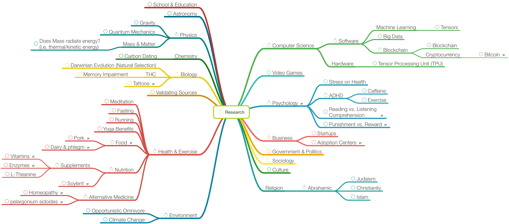

# ResearchMindMap

**Latest Mind Map:**

## What?

_ResearchMindMap_ is a [mind map](https://en.wikipedia.org/wiki/Mind_map) for organizing a wide range of interesting topics to research to later be spoken about on a podcast.

## Why?

> _"Knowledge is power!"_

## How To Open

The application used to make the mind map is [MindNode](https://mindnode.com/) for Mac. In case you do not have access to the application, an image of the latest mind map is provided which can be viewed by anyone.

## How To Contribute

Any pull requests made concerning research errors or supplemental resources must come with a link to a study or some other reputable website (i.e. not [www.TheTruthTheyDontWantYouToKnow.com](http://www.thetruththeydontwantyoutoknow.com)). 

## Curators

- @OrganicCoder
- @AlexChambers
